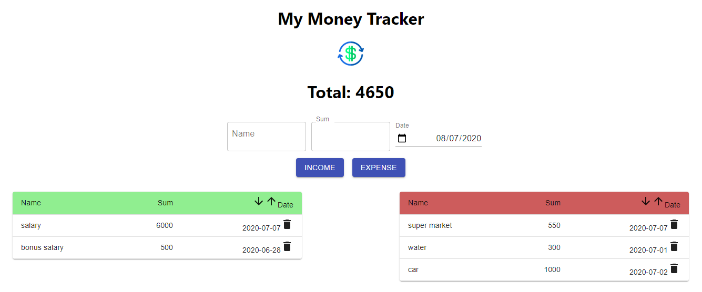

money-tracker-app

The financial tracking app allows management and financial supervision.
Includes:
* Income table and expense table - income / expense that includes name, amount and date.
* Current global amount automatically updated with income / expense
* Sort tables by date - sort in ascending or descending order.

<kbd></kbd>
